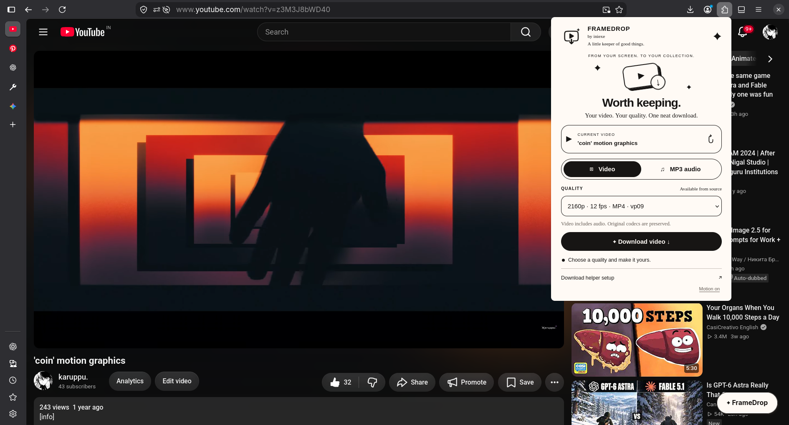
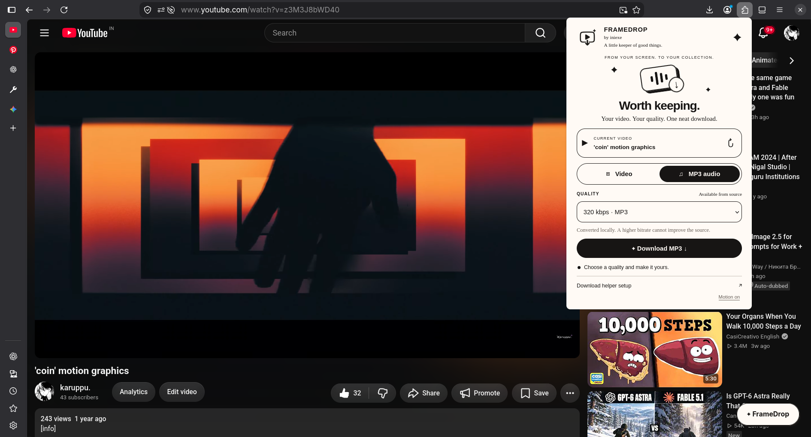
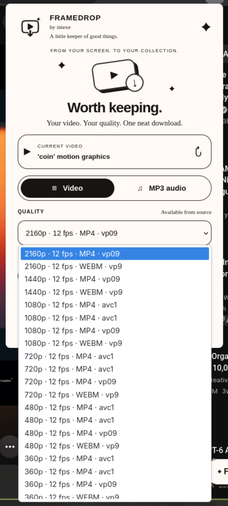

<p align="center">
  
</p>

<h1 align="center">FrameDrop</h1>
<p align="center"><strong>Worth keeping.</strong><br>Video and MP3 downloads, with a little ink-and-paper personality.<br>Created by <strong>iniexe</strong></p>
<p align="center"><strong>v0.1.5 · Local processing · Chrome / Edge / Firefox · MIT</strong></p>

FrameDrop adds a download button to YouTube. Open a video, choose a video format or MP3 bitrate, and save the result on your computer. A warm cream interface, black outlines, subtle animations, and clear status feedback keep the controls simple.

> **Read this before installing:** FrameDrop has **two required parts**: the browser extension and a local Python helper. Loading the extension alone will display the interface but **will not download videos**. Complete all four installation steps below once. After that, the browser starts the helper automatically; you do not need to keep a terminal open.

**Start here:** [Installation](#installation) · [Usage](#usage) · [Troubleshooting](#troubleshooting) · [Upload to GitHub](docs/GITHUB-UPLOAD.md)

## Screenshots

### Video mode

The current video appears above the output controls. Select a quality and download video with audio.



### MP3 mode

Switch to audio-only output and choose 128, 192, or 320 kbps.



<details>
<summary><strong>View the available-quality selector</strong></summary>
<br>


The menu is built from the formats exposed for that video. Repeated resolutions can represent different containers, codecs, or source format IDs.
</details>

*These supplied screenshots demonstrate video detection, quality discovery, and the MP3 interface. They do not document a completed file download.*

## Features

- **YouTube integration:** a floating FrameDrop button on watch pages and Shorts, plus the browser toolbar popup.
- **Source-based quality selection:** resolution, frame rate, source container, codec, and HDR information when available.
- **Video with audio:** merges separate streams locally through FFmpeg.
- **MP3 output:** 128, 192, and 320 kbps conversion.
- **Progress and status:** extraction, download, processing, completion, cancellation, and readable helper errors.
- **Interactive design:** sliding output switch, equalizer illustration, button feedback, and a completion sparkle.
- **Accessible motion:** respects system reduced-motion settings and remembers the popup's Motion toggle.
- **Local workflow:** no FrameDrop account, cloud backend, or hosted conversion service.

## Requirements

| Requirement | Purpose | Installed by FrameDrop setup? |
| --- | --- | --- |
| Python **3.10+** with `venv` and `pip` | Runs the helper | No |
| FFmpeg **and ffprobe** | Merges video/audio and converts MP3 | No |
| Current Deno | JavaScript runtime used during YouTube extraction | No |
| `yt-dlp[default]` | Extracts formats and downloads media | **Yes**, inside `.venv` |
| Recent desktop browser | Runs the extension | No |

The selected setup path uses Deno. Node.js and npm are **not needed for normal installation**; they are only used for developer tests.

FFmpeg is a system program: `pip install ffmpeg` is **not** a replacement for the `ffmpeg` and `ffprobe` executables. See the [official FFmpeg downloads](https://ffmpeg.org/download.html) and [yt-dlp dependency documentation](https://github.com/yt-dlp/yt-dlp#dependencies).

### Browser support

| Browser | Folder to load | Helper setup option | Notes |
| --- | --- | --- | --- |
| Chrome 127+ | `extension` | `--browser chrome --id YOUR_EXTENSION_ID` | Developer mode / Load unpacked |
| Edge 127+ | `extension` | `--browser edge --id YOUR_EXTENSION_ID` | Developer mode / Load unpacked |
| Chromium 127+ | `extension` | `--browser chromium --id YOUR_EXTENSION_ID` | Uses Chromium's registration location |
| Firefox 128+ | `extension-firefox/manifest.json` | `--browser firefox` | Temporary installation; reload after browser restart |

Other browser forks and mobile browsers are not validated. In particular, Snap/Flatpak packaging can prevent a browser from finding or launching the host. Start with a standard system-installed browser if native messaging fails.

## Installation

### 1. Download and extract the complete project

On GitHub, choose **Code → Download ZIP**, then extract it to a permanent folder, such as `Documents/FrameDrop`.

Open that folder. You should see **`README.md`**, **`setup.py`**, **`helper`**, **`extension`**, and **`extension-firefox`** together. This is the **project root** used in the commands below.

- Do not run the project from inside a ZIP viewer.
- Do not download only the extension folder: the helper files are also required.
- Keep the project at the same location after setup. Moving or renaming it breaks the registered helper path until you rerun setup.

### 2. Install the requirements for your operating system

Choose **one** section below.

<details open>
<summary><strong>Windows 10 / 11</strong></summary>

1. Install a supported Python 3 release from [Python.org](https://www.python.org/downloads/windows/). Use the regular installer or install manager, not the embeddable ZIP. If offered, enable **Add Python to PATH** and install the launcher.
2. Open **PowerShell** and install FFmpeg and Deno using Windows Package Manager:

```powershell
winget install --id Gyan.FFmpeg --exact
winget install --id DenoLand.Deno --exact
```

3. Close PowerShell and open a **new** PowerShell window so updated PATH entries are available.
4. Verify:

```powershell
py --version
ffmpeg -version
ffprobe -version
deno --version
```

Each command should print a version, rather than “not recognized.” Python must be 3.10 or newer.

If `winget` is unavailable, use the Windows builds linked by [FFmpeg](https://ffmpeg.org/download.html#build-windows) and [Deno's installation guide](https://docs.deno.com/runtime/getting_started/installation/). For a manually extracted FFmpeg build, add its **`bin`** directory to your user PATH; that directory must contain `ffmpeg.exe` and `ffprobe.exe`. Open a new terminal and verify again.

If `py` is missing but `python --version` reports a supported Python 3, use `python` in place of `py` in this guide.

</details>

<details>
<summary><strong>macOS</strong></summary>

If [Homebrew](https://brew.sh/) is installed, open Terminal and run:

```sh
brew install python ffmpeg deno
```

If Homebrew is not installed, follow its installation instructions first, including its printed shell setup instructions, or install the dependencies through their official download pages.

Open a new Terminal window and verify:

```sh
python3 --version
ffmpeg -version
ffprobe -version
deno --version
```

Each command must print a version. Python must be 3.10 or newer. If your shell still resolves an older system Python, use the newly installed Python interpreter to run setup.

</details>

<details>
<summary><strong>Linux — Ubuntu / Debian</strong></summary>

Use a distribution release with Python 3.10 or newer. In Terminal:

```sh
sudo apt update
sudo apt install python3 python3-venv python3-pip ffmpeg curl unzip
```

Install Deno using its official installer:

```sh
curl -fsSL https://deno.land/install.sh -o /tmp/framedrop-deno-install.sh
sh /tmp/framedrop-deno-install.sh
```

Follow the installer's PATH instructions. For its default installation location, make Deno available in the current terminal with:

```sh
export PATH="$HOME/.deno/bin:$PATH"
```

Persist that PATH entry in the startup file for your shell, following the Deno instructions, so future terminals can also find it.

Verify:

```sh
python3 --version
ffmpeg -version
ffprobe -version
deno --version
```

For Fedora, Arch, or other distributions, install Python with virtual-environment support and FFmpeg/ffprobe using that distribution's package manager. Use the [official Deno installation guide](https://docs.deno.com/runtime/getting_started/installation/) for Deno, then run the same version checks. Distribution-specific package commands beyond Ubuntu/Debian are not provided here.

</details>

### 3. Load the extension for your browser

#### Chrome / Edge / Chromium

1. Open **`chrome://extensions`** in Chrome/Chromium or **`edge://extensions`** in Edge.
2. Enable **Developer mode**.
3. Click **Load unpacked**.
4. Select the project's **`extension` folder**. It directly contains `manifest.json`.
5. Copy FrameDrop's **32-letter extension ID** from the extensions page. You will use it in Step 4.
6. Pin FrameDrop from the browser's extensions menu if you want a toolbar shortcut.

**Folder check:** choose `FrameDrop/extension`, not the outer `FrameDrop` folder, and not `extension-firefox`.

#### Firefox

1. Open **`about:debugging#/runtime/this-firefox`**.
2. Choose **Load Temporary Add-on**.
3. Open the project's **`extension-firefox`** folder and select **`manifest.json`**.
4. Use the fixed add-on ID **`framedrop@inianexe`**. The setup script supplies it automatically.

Do not copy Firefox's internal UUID. The fixed add-on ID intentionally differs from the visible “by iniexe” branding.

Firefox removes temporary add-ons when the browser closes. After restarting Firefox, repeat the temporary-loading steps. You do **not** have to reinstall dependencies or rerun helper setup each time. Persistent distribution requires a signed Firefox package; this repository does not include one. See [Mozilla's temporary-installation guide](https://extensionworkshop.com/documentation/develop/temporary-installation-in-firefox/).

### 4. Connect the local helper

Open a terminal **inside the project root**, where `setup.py` is located.

- **Windows:** open the folder in File Explorer, type `powershell` in the address bar, and press Enter.
- **macOS/Linux:** open Terminal and run `cd` followed by your folder path. You can drag the folder into Terminal to insert its path after `cd `.

Run **one command** matching your browser and operating system. Replace `YOUR_EXTENSION_ID` with the actual ID from Step 3; do not type the placeholder literally.

| Browser | Windows PowerShell | macOS / Linux Terminal |
| --- | --- | --- |
| Firefox | `py setup.py --browser firefox` | `python3 setup.py --browser firefox` |
| Chrome | `py setup.py --browser chrome --id YOUR_EXTENSION_ID` | `python3 setup.py --browser chrome --id YOUR_EXTENSION_ID` |
| Edge | `py setup.py --browser edge --id YOUR_EXTENSION_ID` | `python3 setup.py --browser edge --id YOUR_EXTENSION_ID` |
| Chromium | `py setup.py --browser chromium --id YOUR_EXTENSION_ID` | `python3 setup.py --browser chromium --id YOUR_EXTENSION_ID` |

Setup performs these steps automatically:

1. Creates an isolated Python environment in `.venv`.
2. Installs or updates `yt-dlp[default]` there.
3. Starts the helper's diagnostic check and verifies required programs can be found.
4. Registers the helper for your browser and extension ID.

Wait until you see **`Setup complete.`** If a dependency is marked **MISSING**, install it, verify its command works, and rerun the same setup command. Do not continue assuming registration succeeded.

Restart the browser after the first setup. Firefox users must then load the temporary add-on again. Open a YouTube video and click FrameDrop: the video should be detected and its formats should appear.

**You can close the terminal now.** The browser starts the helper when needed. If you use multiple browsers, run Step 4 separately for each browser; their extension IDs and registration locations differ.

## Usage

### Download a video

1. Open a single public YouTube video or Short that you own or have permission to save.
2. Click the floating **✦ FrameDrop** button, or the pinned toolbar icon.
3. Wait for quality discovery. If you switched videos, click the **↻** refresh button.
4. Select **Video**.
5. Choose a quality. For example, `2160p · 12 fps · MP4 · vp09` describes a **source** format, not a promise to upscale or change frame rate.
6. Click **Download video**.
7. Wait through downloading and merging until **Saved to …** appears.
8. Open the output folder below and play the file.

### Download MP3 audio

1. Open the video and wait for format discovery.
2. Select **MP3 audio**.
3. Choose **128**, **192**, or **320 kbps**.
4. Click **Download MP3**.
5. Wait for the download and conversion to finish, then open the output folder.

A higher MP3 bitrate cannot recover detail absent from the original audio.

### Where files are saved

| Operating system | Default output folder |
| --- | --- |
| Windows | Your user home → `Downloads\FrameDrop` |
| macOS | `~/Downloads/FrameDrop` |
| Linux | `~/Downloads/FrameDrop` |

This is the helper's folder under your user home, **not** a browser-selected download directory. A localized, redirected, or custom Downloads folder is not automatically detected in this version. The completion message shows the actual path used. Files will not appear as ordinary entries in the browser's Downloads panel because the helper writes them directly.

### Understand formats and progress

- Qualities depend on the formats yt-dlp can access for the current video. Some videos expose fewer options.
- When video and audio arrive separately, FrameDrop merges them into **MKV**, preserving their codecs. A source that already contains audio may keep MP4 or WebM. The format menu describes the source stream; it does not force every final file to be MP4.
- Repeated-looking menu entries are separate source formats. Automatic deduplication is not included.
- Progress is reported per media stream. It may restart when the audio stream begins.
- During merging or MP3 conversion, the progress indicator is indeterminate.
- One task runs at a time. Closing the popup does not intentionally cancel it; keep the browser running.
- **Cancel task** closes the helper connection. Partial files may remain. Check the folder before starting another download; support for resuming depends on the source and download state.
- Use **Motion on/off** to control animations. Your system's reduced-motion setting takes priority.

## Troubleshooting

| Problem | What to do |
| --- | --- |
| `background.service_worker is currently disabled` | You loaded the Chrome build in Firefox. Load `extension-firefox/manifest.json`. |
| Manifest missing or unreadable | Extract the complete ZIP. In Chrome/Edge select `extension`; in Firefox select `extension-firefox/manifest.json`. |
| Helper unavailable / native application not found | Run Step 4 for the correct browser. Check the exact extension ID and keep the project at its installed path. |
| Helper disconnected / exited | Run the helper diagnostic below and read the actual error in the popup. A moved folder, deleted `.venv`, missing dependency, or browser sandbox can cause this. |
| FFmpeg, ffprobe, or Deno is MISSING | Install the executable, open a new terminal, verify its version command, then rerun setup. A Python package with the same name is not enough. |
| `python3-venv` / `ensurepip` error on Linux | Install the distribution's Python venv package, then rerun setup. On Ubuntu/Debian: `sudo apt install python3-venv`. |
| `can't open file … setup.py` | Your terminal is in the wrong folder. Change into the folder containing `setup.py`. |
| Permission / managed-browser error | Browser or device management may prohibit native messaging or developer extensions. Contact the device administrator. |
| Toolbar button works but page button does not | Reload the YouTube page after installing the extension and use the pinned toolbar button. |
| No formats, extractor error, or YouTube error | Update yt-dlp by rerunning setup, then try a permitted public video. Some videos/networks are inaccessible to the extractor. |
| Final video is MKV | Expected for merged streams. FrameDrop preserves source codecs rather than promising MP4 conversion. |
| “Saved” but browser Downloads is empty | Open the helper's `Downloads/FrameDrop` folder shown in the completion message. |
| Firefox add-on disappears after restart | Reload the temporary add-on. This does not require rerunning helper setup. |
| Works in one browser but not another | Register the helper for the second browser and its extension ID. Forks and Snap/Flatpak distributions need separate compatibility investigation. |

### Run a helper diagnostic

From the project root, **after setup has created `.venv`**:

Windows:

```powershell
.venv\Scripts\python.exe helper\doctor.py
```

macOS / Linux:

```sh
.venv/bin/python helper/doctor.py
```

The diagnostic starts the Python helper and checks native-message framing and dependency discovery. It **does not** prove browser registration or a real YouTube download works. If it succeeds but the browser cannot connect, rerun Step 4 and check the browser/ID/path.

When reporting a problem, include your OS, browser/version, FrameDrop version, exact popup message, and diagnostic output. Remove personal file paths if you do not want to share them.

## Update

1. Stop any active download.
2. Back up the existing installation folder if needed.
3. Replace its source files with the new release, keeping its location stable.
4. Rerun the same `setup.py` command to update yt-dlp and refresh registration.
5. Reload the extension from the browser's extensions page and refresh YouTube.

If you move to a new folder instead, load the extension from that folder and run setup there. Chrome/Edge may assign a different unpacked extension ID, so copy the current one again. Keep `.venv` and generated host files out of GitHub.

## Privacy and scope

FrameDrop does not operate a cloud conversion service or collect analytics. The extension passes the selected URL to the local helper, which contacts YouTube and its media services. Those network providers still receive normal requests. Popup task state, video metadata, and the motion preference are stored in the extension's local storage. See [PRIVACY.md](PRIVACY.md).

This release supports individual accessible videos. Playlists, live/upcoming streams, login/cookie import, age-restricted media, and protected content are outside its supported scope. Download only material you own or are allowed to save.

## Development and verification

The extension is plain HTML, CSS, and JavaScript; there is no frontend build step. Python tests and the JavaScript background tests do not need YouTube access.

```sh
python3 -m unittest discover -s tests
node --test tests/background.cjs
python3 tools/check_repo.py
```

On Windows, replace `python3` with `py`. `check_repo.py` also runs JavaScript syntax checks, so Node.js must be available for that developer command.

For an optional **mocked** browser UI smoke test:

```sh
npm install
npx playwright install chromium
npm run test:ui
```

The UI test uses fake metadata and does not download YouTube media. A GitHub Actions workflow runs the offline checks on pushes and pull requests. It has not yet run on your repository; do not treat the workflow file as a passing CI badge.

**Verification at packaging:** local helper validation tests, background connection regression tests, and repository consistency checks are run before producing the ZIP. Supplied screenshots show the UI with discovered formats. Full browser/OS installation coverage and a completed live download have not been independently verified here. See [docs/VALIDATION.md](docs/VALIDATION.md).

## Repository contents

| Path | Purpose |
| --- | --- |
| `extension/` | Chrome, Edge, and Chromium build; load this folder |
| `extension-firefox/` | Firefox build; load its manifest |
| `helper/` | Python host, installer, requirements, and diagnostic |
| `setup.py` | One setup entry point for dependency installation and registration |
| `docs/screenshots/` | The three supplied screenshots used above |
| `tests/` | Helper tests, background regression tests, optional UI smoke test |
| `tools/` | Repository validation and clean ZIP packaging |
| `.github/workflows/checks.yml` | Offline GitHub Actions checks |
| `LICENSE` | MIT terms for FrameDrop source code |

## Publish this repository

Read [the GitHub upload guide](docs/GITHUB-UPLOAD.md) for exact steps, a suggested repository description, and release packaging instructions. **Upload the extracted contents so `README.md` sits at the repository root.** Uploading only the ZIP as a repository file will not display this README or its screenshots.

## Credits and license

Created by **iniexe**. Powered by [yt-dlp](https://github.com/yt-dlp/yt-dlp), [FFmpeg](https://ffmpeg.org/), and [Deno](https://deno.com/).

FrameDrop source code is licensed under [MIT](LICENSE). Dependencies retain their own licenses. The supplied screenshots document the interface; third-party website/video imagery and trademarks remain with their respective owners. FrameDrop is not affiliated with YouTube, Google, Microsoft, or Mozilla.
